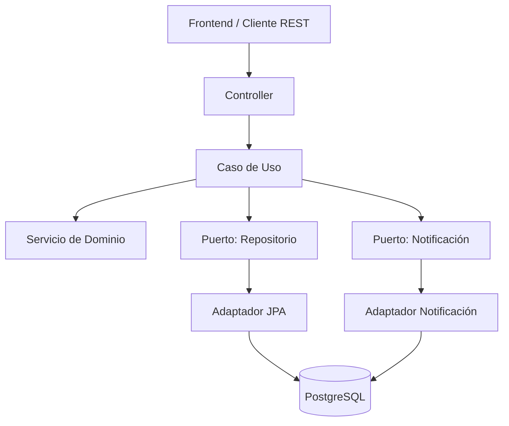
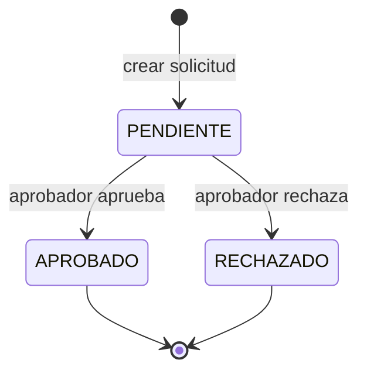

# Kata: Flujo Genérico de Aprobación

Proyecto desarrollado como solución a un reto técnico (kata) de backend/cloud: aplicación web que centraliza flujos genéricos de aprobación — despliegue de microservicios, acceso a herramientas internas, cambios técnicos e incorporación de nuevas herramientas al catálogo. Permite crear solicitudes, notificar al aprobador, aprobar/rechazar con comentarios y mantener el histórico completo de decisiones.

> **Estado actual**: backend y frontend están completos. El backend expone una **API RESTful** (JSON sobre HTTP, ver sección [API](#api)) que se puede probar entera con Postman o Swagger sin necesidad de frontend. El frontend (React + Vite) cubre los 5 requisitos funcionales del kata de punta a punta. Lo único pendiente es el despliegue a AWS (ver [Pruebas en la nube](#pruebas-en-la-nube-aws)).

## Funcionalidad

- Crear una solicitud de aprobación (título, descripción, solicitante, aprobador, tipo).
- Notificar al aprobador mediante una bandeja de entrada in-app cuando tiene una solicitud pendiente.
- Aprobar o rechazar una solicitud, con comentario opcional.
- Consultar el histórico completo: estado, fecha, usuario que actuó y comentarios.
- Cada solicitud tiene un ID único (UUID).

## Stack

| Capa | Tecnología |
|---|---|
| Backend | Java 17 + Spring Boot 3 |
| Persistencia | PostgreSQL (prod) / H2 (tests) |
| Migraciones | Flyway |
| API | RESTful (JSON sobre HTTP), documentada con OpenAPI/Swagger |
| Comunicación Frontend↔Backend | El frontend consume la API REST directo vía `fetch`, sin gateway/BFF intermedio (ver [Limitaciones](#limitaciones-y-decisiones-de-alcance)). En local, el dev server de Vite hace proxy de `/api` hacia el backend — no hace falta configurar CORS. |
| Tests | JUnit 5 + Mockito + Spring Boot Test |
| Frontend | React (JavaScript) + Vite + Tailwind CSS — selector de usuario simulado (sin auth real, mismo criterio que `X-Usuario`) |
| Build | Maven (backend) / npm (frontend) |
| DB local | Docker Compose (PostgreSQL) |
| CI/CD | GitHub Actions (build + tests en cada push/PR a `main` o `develop`) |

## Arquitectura

El backend sigue arquitectura hexagonal (puertos y adaptadores): el dominio no depende de frameworks ni de infraestructura.



### Ciclo de vida de una solicitud



### Estructura de paquetes (backend)

```
backend/src/main/java/com/kata/aprobaciones/
├── domain/
│   ├── model/        Solicitud, HistorialCambio, Notificacion, EstadoSolicitud, TipoSolicitud
│   ├── exception/     excepciones de dominio
│   └── port/
│       ├── in/        casos de uso (interfaces)
│       └── out/       repositorios, notificación (interfaces)
├── application/       implementación de los casos de uso
└── infrastructure/
    ├── persistence/    entidades JPA, mappers, adapters
    ├── web/            controllers + DTOs + manejo de errores
    └── notification/   bandeja de entrada simulada
```

### Estructura de paquetes (frontend)

```
frontend/src/
├── api/
│   └── client.js       wrapper de fetch para los 7 endpoints del backend
├── context/
│   └── UsuarioContext.jsx   selector de usuario simulado (jperez, mgarcia, alopez)
├── components/
│   └── Layout.jsx       nav + selector de usuario + Outlet del router
├── pages/
│   ├── CrearSolicitud.jsx
│   ├── ListarSolicitudes.jsx
│   ├── DetalleSolicitud.jsx   detalle + historial + aprobar/rechazar
│   └── Notificaciones.jsx
├── App.jsx              rutas (react-router-dom)
└── main.jsx
```

## API

Todas las rutas requieren el header `X-Usuario` (simula el usuario de red autenticado, sin JWT real).

| Método | Ruta | Descripción |
|---|---|---|
| POST | `/api/solicitudes` | Crear solicitud |
| GET | `/api/solicitudes` | Listar solicitudes (filtros opcionales: `aprobador`, `estado`) |
| GET | `/api/solicitudes/{id}` | Detalle + histórico completo |
| PATCH | `/api/solicitudes/{id}/aprobar` | Aprobar (solo el aprobador asignado, solo si está `PENDIENTE`) |
| PATCH | `/api/solicitudes/{id}/rechazar` | Rechazar (mismas reglas que aprobar) |
| GET | `/api/notificaciones/{usuario}` | Bandeja de entrada del usuario |
| PATCH | `/api/notificaciones/{id}/leer` | Marcar notificación como leída |
| GET | `/api/catalogo/tipos` | Catálogo de tipos de solicitud (para el dropdown del frontend) |

Con el backend corriendo, la documentación interactiva está en `http://localhost:8080/swagger-ui/index.html`.

## Cómo correr el proyecto

### Requisitos
- Git
- Java 17
- Node 20+ (para el frontend)
- Docker + Docker Compose (para PostgreSQL local)

### 0. Clonar el repositorio

```bash
git clone https://github.com/CRISTIANGUZMAN-DR/kata-aprobaciones.git
cd kata-aprobaciones
```

Estructura del repo:

```
kata-aprobaciones/
├── backend/     ← API Spring Boot (Java 17, Maven)
├── frontend/    ← SPA React + Vite + Tailwind
├── docker-compose.yml
├── postman/
└── README.md
```

### 1. Levantar la base de datos

```bash
cp .env.example .env
# editar .env y poner una contraseña real en DB_PASSWORD
docker compose up -d
```

Verificar que quedó sana:

```bash
docker compose ps   # debe mostrar "healthy"
```

### 2. Levantar el backend

```bash
cd backend
DB_PASSWORD=<la misma que pusiste en .env> ./mvnw spring-boot:run
```

La API queda disponible en `http://localhost:8080`. Al arrancar, Flyway crea el esquema automáticamente (no hace falta correr scripts a mano).

### 3. Levantar el frontend

```bash
cd frontend
npm install
npm run dev
```

La SPA queda disponible en `http://localhost:5173` — el dev server de Vite hace proxy de `/api` hacia `http://localhost:8080`, así que el backend tiene que estar corriendo (paso anterior).

### 4. Bajar todo cuando termines

```bash
# Ctrl+C en las terminales donde corren spring-boot:run y npm run dev (o):
pkill -f "spring-boot:run"
pkill -f "vite"

# Bajar y borrar el contenedor de PostgreSQL:
docker compose down

# Si además querés borrar los datos guardados (empezar de cero la próxima vez):
docker compose down -v
```

### Tests

```bash
cd backend
./mvnw test              # unit + @WebMvcTest (usa H2 en memoria, no necesita Docker)
./mvnw clean verify       # + tests de integración (@SpringBootTest, también con H2)
./mvnw jacoco:report      # reporte de cobertura en target/site/jacoco/index.html
```

## Probar con Postman

La colección está en [`postman/kata-aprobaciones.postman_collection.json`](postman/kata-aprobaciones.postman_collection.json), con los 7 endpoints organizados en 3 carpetas (Solicitudes, Notificaciones, Catálogo) y casos de error incluidos (400, 404, 409).

1. **Importar**: Postman → `Import` → seleccionar ese archivo.
2. La colección trae variables propias (`baseUrl`, `solicitudId`, `notificacionId`) con `baseUrl` ya en `http://localhost:8080` — no hace falta crear un Environment aparte.
3. Con el backend corriendo (ver arriba), flujo sugerido:
   1. Correr **"Crear solicitud"** → copiar el `id` de la respuesta y pegarlo en la variable de colección `solicitudId`
   2. Correr **"Bandeja de entrada del aprobador"** → copiar el `id` de la notificación en `notificacionId`
   3. Probar el resto: listar, obtener detalle, aprobar/rechazar, marcar notificación como leída, catálogo de tipos

## Pruebas en la nube (AWS)

> ⏳ **Pendiente** — el deploy a AWS todavía no se hizo (backend y frontend se están terminando primero). Esta sección se completa apenas la app quede corriendo en EC2.

- **Frontend**: `<URL pendiente>`
- **Backend / API**: `<URL pendiente>`
- **Swagger**: `<URL pendiente>/swagger-ui/index.html`

## Usuarios de prueba

Usuarios ficticios para probar el flujo (sin autenticación real, se seleccionan desde el frontend o se pasan a mano en el header `X-Usuario`):

- `jperez`
- `mgarcia`
- `alopez`

## Cobertura y calidad

- 35 tests (dominio, casos de uso con Mockito, controllers con `@WebMvcTest`, integración con `@SpringBootTest` + H2 + Flyway)
- ≥80% de cobertura en `domain` + `application` (gate configurado en el proyecto)
- CI en GitHub Actions: build + tests en cada push/PR a `main` o `develop`

## Limitaciones y decisiones de alcance

Dado el tiempo acotado del reto, quedaron fuera de alcance a propósito (no por descuido):

- **Sin capa de API Gateway / BFF**: el frontend le habla directo al backend Spring Boot — no hay una capa intermedia que agregue requests, centralice rate limiting o desacople el contrato del front del contrato interno del backend. Para el tamaño de este kata no se justifica; en un sistema real con más de un cliente o más de un servicio backend, sí tendría sentido agregarla.
- **`X-Usuario` es simulado, no autenticación real**: no hay JWT ni validación de identidad — cualquiera puede mandar cualquier usuario en el header. Suficiente para el alcance del kata (que explícitamente no pide auth real), pero no es un patrón productivo.
