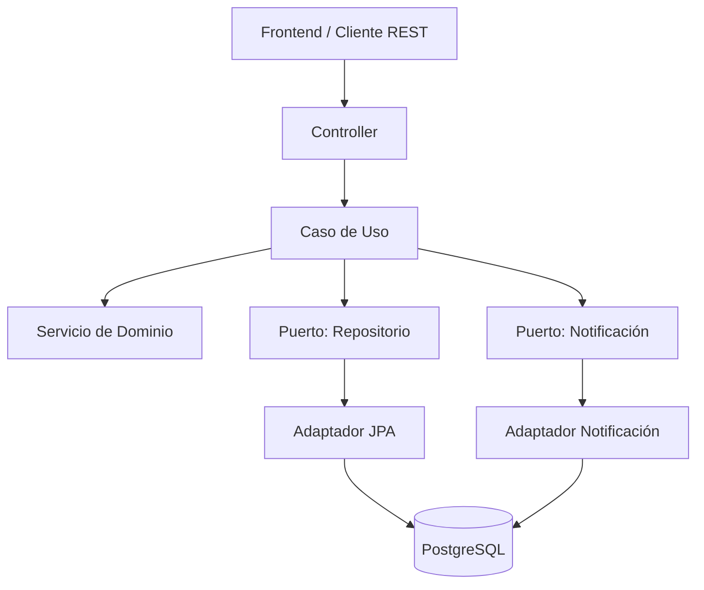
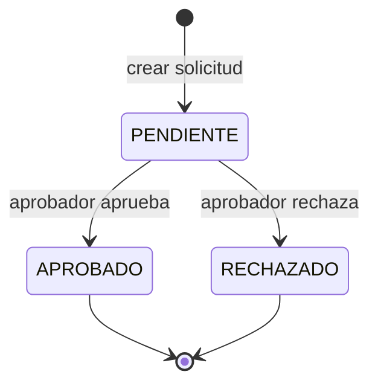

# Flujo Genérico de Aprobación

Aplicación web que centraliza flujos genéricos de aprobación: despliegue de microservicios, acceso a herramientas internas, cambios técnicos e incorporación de nuevas herramientas al catálogo. Permite crear solicitudes, notificar al aprobador, aprobar/rechazar con comentarios y mantener el histórico completo de decisiones.

## Funcionalidad

- Crear una solicitud de aprobación (título, descripción, solicitante, aprobador, tipo).
- Notificar al aprobador mediante una bandeja de entrada in-app cuando tiene una solicitud pendiente.
- Aprobar o rechazar una solicitud, con comentario opcional.
- Consultar el histórico completo: estado, fecha, usuario que actuó y comentarios.
- Cada solicitud tiene un ID único (UUID).

## Stack

| Capa | Tecnología |
|---|---|
| Backend | Java 17 + Spring Boot 3 |
| Persistencia | PostgreSQL (prod) / H2 (tests) |
| Migraciones | Flyway |
| API | REST + JSON |
| Tests | JUnit 5 + Mockito + Spring Boot Test |
| Frontend | React + Vite (selector de usuario simulado, sin auth real) |
| Build | Maven |
| Deploy | Docker + docker-compose |

## Arquitectura

El backend sigue arquitectura hexagonal (puertos y adaptadores): el dominio no depende de frameworks ni de infraestructura.



### Ciclo de vida de una solicitud



### Estructura de paquetes (backend)

```
src/main/java/com/kata/aprobaciones/
├── domain/
│   ├── model/        Solicitud, Comentario, EstadoSolicitud, TipoSolicitud
│   ├── service/       reglas de negocio
│   └── port/
│       ├── in/        casos de uso (interfaces)
│       └── out/       repositorio, notificación (interfaces)
├── application/       implementación de los casos de uso
└── infrastructure/
    ├── persistence/    JPA
    ├── web/            controllers + DTOs
    ├── notification/   bandeja de entrada simulada
    └── config/
```

## API

Todas las rutas requieren el header `X-Usuario` (simula el usuario de red autenticado).

| Método | Ruta | Descripción |
|---|---|---|
| POST | `/api/solicitudes` | Crear solicitud |
| GET | `/api/solicitudes` | Listar solicitudes (filtros: `aprobador`, `estado`) |
| GET | `/api/solicitudes/{id}` | Detalle + histórico |
| PATCH | `/api/solicitudes/{id}/aprobar` | Aprobar |
| PATCH | `/api/solicitudes/{id}/rechazar` | Rechazar |
| GET | `/api/notificaciones/{usuario}` | Bandeja de entrada del aprobador |
| PATCH | `/api/notificaciones/{id}/leer` | Marcar notificación como leída |
| GET | `/api/catalogo/tipos` | Catálogo de tipos de solicitud |

## Cómo correr el proyecto

### Requisitos
- Java 17
- Docker + docker-compose (para PostgreSQL local)

### Backend

```bash
docker-compose up -d          # levanta PostgreSQL
cp src/main/resources/application-local.yml.example src/main/resources/application-local.yml
# editar application-local.yml con tus credenciales locales
./mvnw spring-boot:run
```

La API queda disponible en `http://localhost:8080`.

### Tests

```bash
./mvnw test              # tests
./mvnw jacoco:report      # reporte de cobertura (target/site/jacoco/index.html)
```

## Usuarios de prueba

Usuarios ficticios para probar el flujo (sin autenticación real, se seleccionan desde el frontend):

- `jperez`
- `mgarcia`
- `alopez`
